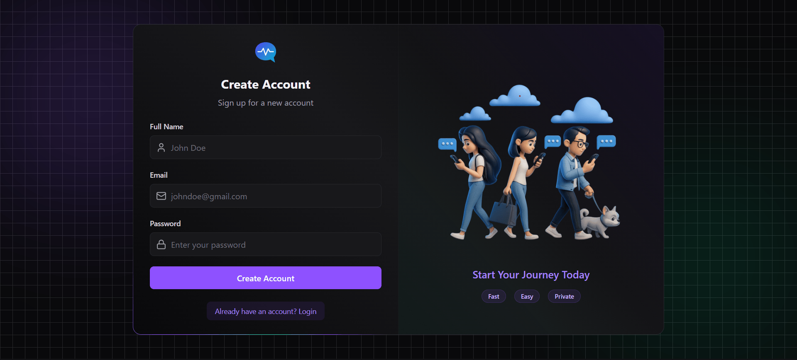
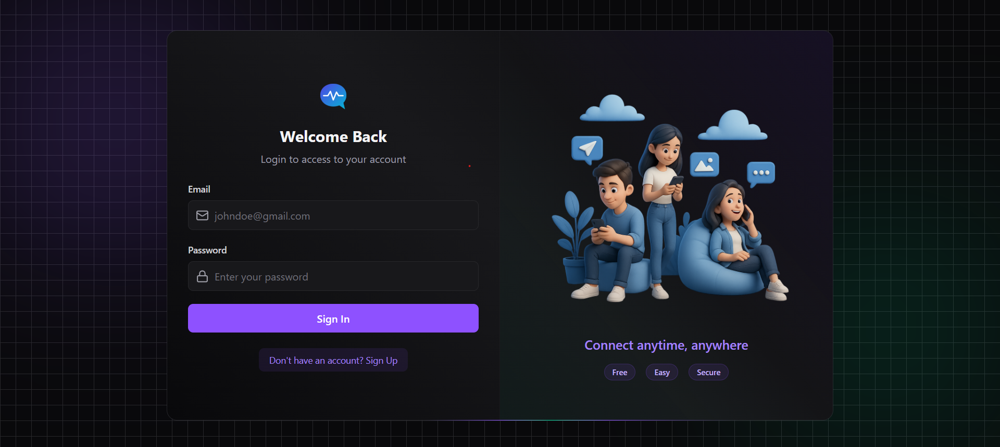
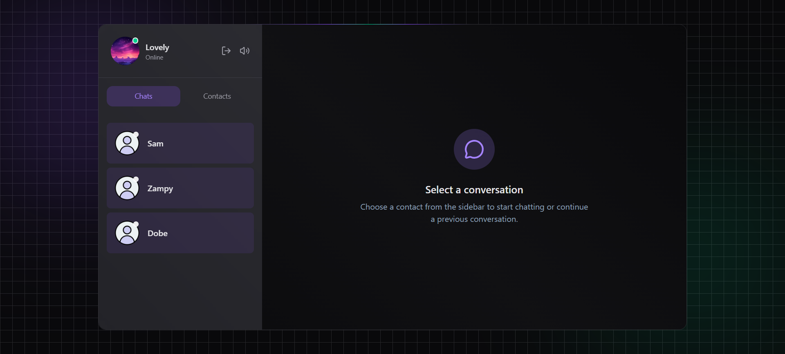
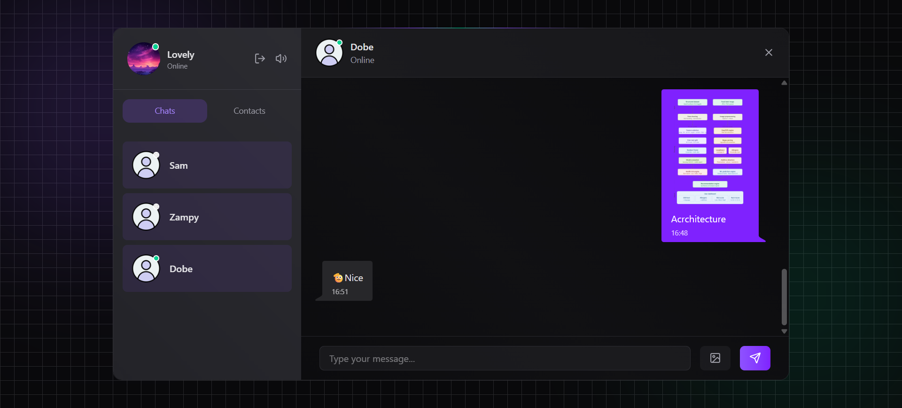
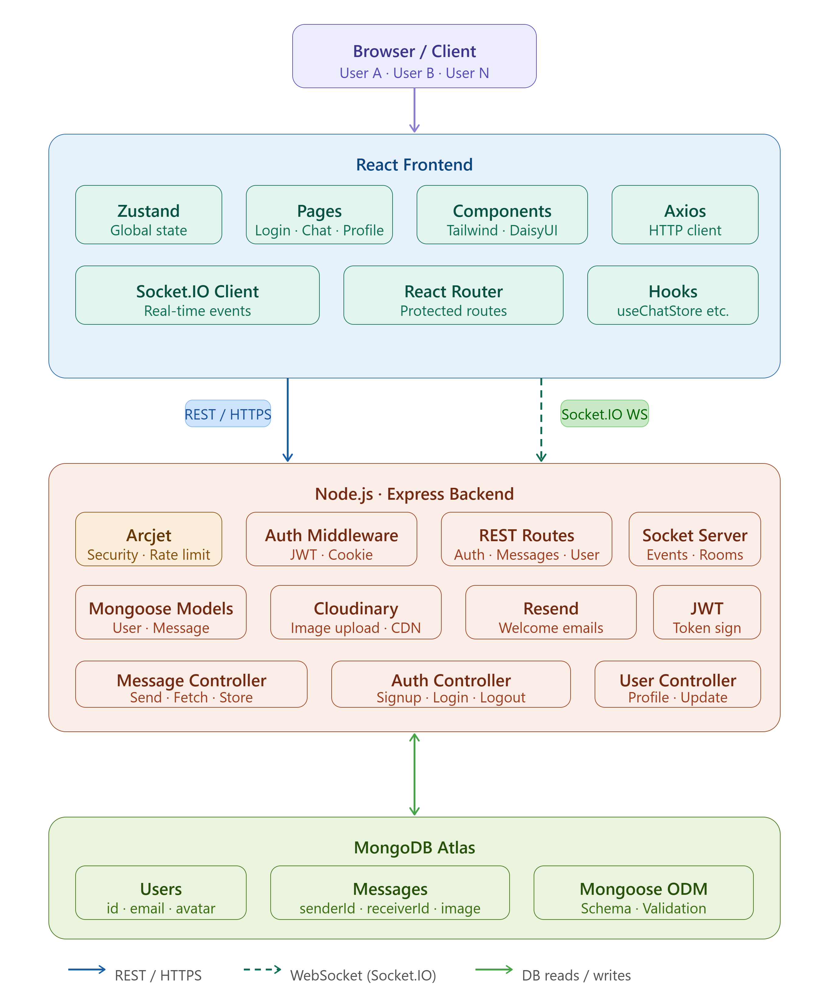
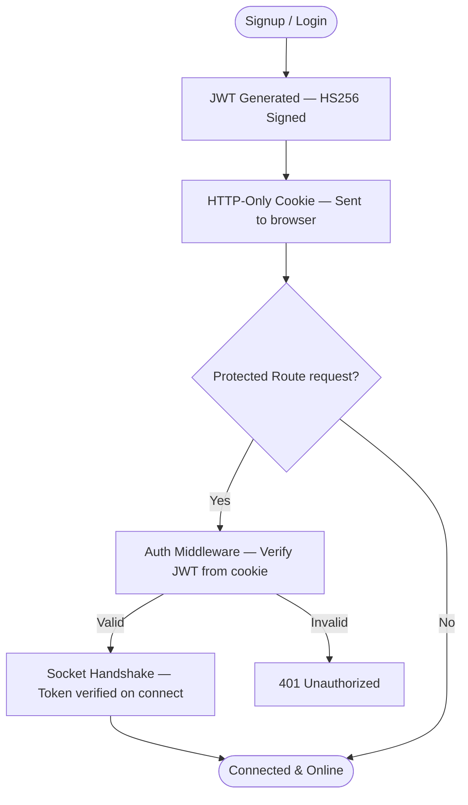
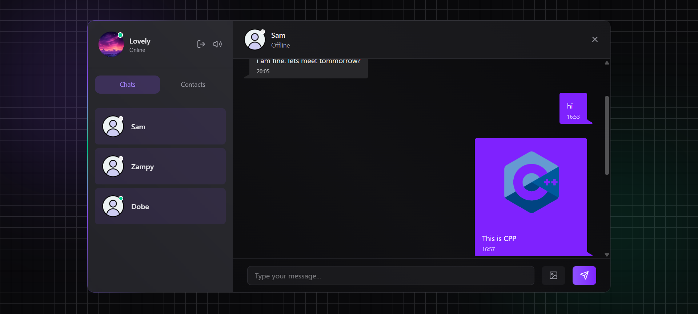
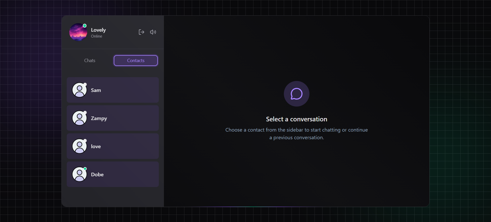
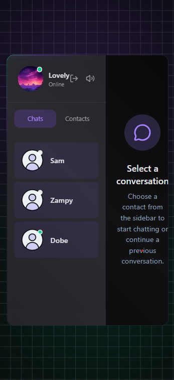
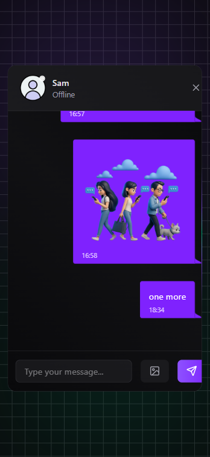

<div align="center">

<!-- Animated Title Banner -->


<br/>
<br/>

<!-- Animated Title -->
<picture>
  <source media="(prefers-color-scheme: dark)" srcset="./screenshots/logo.png">
  
</picture>

#  Pulse

### ⚡ Chat instantly. Share effortlessly. Stay connected.

<br/>

<!-- Animated typing effect via SVG -->
[](https://git.io/typing-svg)

<br/>

<!-- Tech Badges -->
[](https://react.dev)
[](https://nodejs.org)
[](https://mongodb.com)
[](https://socket.io)
[](https://tailwindcss.com)
[](https://zustand-demo.pmnd.rs)

<br/>

<!-- Stats row -->


<br/>

---

### 🔗 [Live Demo](https://pulse-1-r68b.onrender.com/) &nbsp;·&nbsp; [Report Bug](https://github.com/LovelySharma-dev/pulse/issues) &nbsp;·&nbsp; [Request Feature](https://github.com/LovelySharma-dev/pulse/issues)

---

</div>

<br/>

## 📋 Table of Contents

- [✨ Overview](#-overview)
- [🎥 Demo](#-demo)
- [🌟 Features](#-features)
- [🖥️ Tech Stack](#️-tech-stack)
- [📁 Project Structure](#-project-structure)
- [⚡ Real-Time Architecture](#-real-time-architecture)
- [🔒 Auth Flow](#-auth-flow)
- [⚙️ Environment Variables](#️-environment-variables)
- [🚀 Getting Started](#-getting-started)
- [🎯 Roadmap](#-roadmap)
- [💡 Lessons Learned](#-lessons-learned)
- [🤝 Contributing](#-contributing)

<br/>

---

## ✨ Overview

> **Pulse** is a production-grade full-stack real-time chat app built on the MERN stack — crafted to deliver *fast*, *beautiful*, and *secure* messaging experiences.

Unlike barebones chat demos, Pulse is built with a real architecture:
- **Optimistic UI** so messages feel instant
- **Socket.IO** for true bi-directional, event-driven communication
- **Cloudinary** for image hosting
- **Arcjet** for security middleware
- **JWT + HTTP-only cookies** for bulletproof auth

Whether you're learning full-stack dev or want a solid chat foundation to build on — **Pulse** has you covered.

<br/>

---

## 🎥 Demo
<div align="center">



</div>

<div align="center">

## 📸 Application Preview

| 📝 Sign Up | 🔐 Login |
|:----------:|:--------:|
|  |  |

<br>

| 💬 Chat Page | 🖼️ Image Sharing |
|:------------:|:----------------:|
|  |  |

</div>

<br/>

---

## 🌟 Features

<br/>

### 💬 Core Messaging

| Feature | Description |
|--------|-------------|
| ⚡ Real-time messaging | Powered by Socket.IO — no refresh needed |
| 🚀 Optimistic UI | Messages appear instantly before server confirms |
| 🖼️ Image sharing | Send images with preview before you hit send |
| 📜 Auto-scroll | Chat always anchors to the latest message |
| 🕒 Timestamps | Every message has human-readable time |

<br/>

### 👥 User Experience

| Feature | Description |
|--------|-------------|
| 🔐 Secure Auth | JWT tokens stored in HTTP-only cookies |
| 🟢 Online Presence | See who's online in real-time |
| 👤 Profile Picture | Upload and update your avatar via Cloudinary |
| 📋 Contacts List | Browse and start conversations easily |
| 🕓 Recent Chats | Quick access to your active conversations |

<br/>

### 🎵 The Fun Stuff

| Feature | Description |
|--------|-------------|
| ⌨️ Typing sounds | Satisfying keyboard clicks as you type |
| 🔔 Notification sounds | Hear incoming messages |
| 🔇 Toggle sounds | Turn effects on/off anytime |
| 🎞️ Smooth animations | Polished transitions throughout |

<br/>

### ⚙️ Backend Power

| Feature | Description |
|--------|-------------|
| 📡 Express REST API | Clean, modular route structure |
| 🍃 MongoDB Atlas | Cloud-hosted database |
| ☁️ Cloudinary | Optimized image uploads & hosting |
| 📧 Resend Emails | Welcome emails on signup |
| 🛡️ Arcjet | Rate limiting & security layer |
| 🔌 Socket.IO | Full-duplex real-time events |

<br/>

---

## 🖥️ Tech Stack

<div align="center">

### Frontend

| Technology | Purpose |
|-----------|---------|
|  | UI Library |
|  | Global State Management |
|  | Utility-first Styling |
|  | Component Library |
|  | HTTP Client |
|  | Client-side Routing |
|  | Icon Library |

<br/>

### Backend

| Technology | Purpose |
|-----------|---------|
|  | Server Runtime |
|  | Web Framework |
|  | Database |
|  | ODM |
|  | Real-time Engine |
|  | Authentication |
|  | Image Hosting |
|  | API Security |

</div>

<br/>

---

## 📁 Project Structure

```
💜 Pulse/
│
├── 🖥️  frontend/
│   ├── 🧩  components/          # Reusable UI components
│   ├── 🪝  hooks/               # Custom React hooks
│   ├── 📄  pages/               # Route-level page components
│   ├── 🗃️  store/               # Zustand global state stores
│   ├── 🛠️  lib/                 # Utility functions & config
│   └── 🎨  assets/             # Images, sounds, static files
│
├── ⚙️  backend/
│   ├── 🎮  controllers/         # Route handler logic
│   ├── 🔒  middleware/          # Auth, error, Arcjet middleware
│   ├── 📐  models/             # Mongoose data schemas
│   ├── 🛣️  routes/             # Express API routes
│   ├── 🛠️  lib/                # DB connection, Cloudinary, utils
│   ├── 📧  emails/             # Resend email templates
│   └── 🔌  socket/             # Socket.IO setup & events
│
└── 📖  README.md
```

<br/>

---

## ⚡ Real-Time Architecture


<div align="center">



</div>


<br/>

---

## 🔒 Auth Flow


<br/>

---

## ⚙️ Environment Variables

Create a `.env` file in `/backend`:

```env
# ── Server ──────────────────────────────────────
PORT=3000
CLIENT_URL=http://localhost:5173

# ── Database ─────────────────────────────────────
MONGODB_URI=mongodb+srv://<username>:<password>@cluster.mongodb.net/pulse

# ── Auth ─────────────────────────────────────────
JWT_SECRET=your_super_secret_jwt_key_here

# ── Cloudinary ───────────────────────────────────
CLOUDINARY_CLOUD_NAME=your_cloud_name
CLOUDINARY_API_KEY=your_api_key
CLOUDINARY_API_SECRET=your_api_secret

# ── Email (Resend) ────────────────────────────────
RESEND_API_KEY=re_xxxxxxxxxxxxxxxxxxxx
EMAIL_FROM=hello@yourdomain.com
EMAIL_FROM_NAME=Pulse

# ── Security (Arcjet) ─────────────────────────────
ARCJET_KEY=ajkey_xxxxxxxxxxxxxxxxxxxx
```

> 💡 **Tip:** Never commit your `.env` file. Add it to `.gitignore` immediately!

<br/>

---

## 🚀 Getting Started

### Prerequisites

Make sure you have these installed:

```bash
node --version   # v18+
npm --version    # v9+
```

You'll also need accounts for:
- [MongoDB Atlas](https://mongodb.com/atlas) — free tier works great
- [Cloudinary](https://cloudinary.com) — free tier works great
- [Resend](https://resend.com) — for welcome emails
- [Arcjet](https://arcjet.com) — for security

<br/>

### 1️⃣ Clone the Repository

```bash
git clone https://github.com/LovelySharma-dev/Pulse.git
cd Pulse
```

### 2️⃣ Set Up the Backend

```bash
cd backend
npm install
```

Create your `.env` file (see [Environment Variables](#️-environment-variables) above), then:

```bash
npm run dev
# ✅ Server running at http://localhost:3000
```

### 3️⃣ Set Up the Frontend

Open a new terminal:

```bash
cd frontend
npm install
npm run dev
# ✅ App running at http://localhost:5173
```

### 4️⃣ Open the App

Navigate to **[http://localhost:5173](http://localhost:5173)** and start chatting! 🎉

<br/>

---

## 📸 Screenshots

<div align="center">

### 🔐 Login Screen


---

### 💬 Chat Screen


---

### 📋 Contacts


---

### 📱 Mobile View
<table>
<tr>
<td align="center">

</td>

<td align="center">

</td>
</tr>
</table>

</div>

<br/>

---

## 🎯 Roadmap

What's coming next for Pulse 👀

- [ ] ⌨️ **Typing Indicator** — See when someone is typing
- [ ] ✅ **Read Receipts** — Know when your message is seen
- [ ] 😊 **Emoji Picker** — React and express yourself
- [ ] 🎙️ **Voice Messages** — Record and send audio
- [ ] 📹 **Video Calling** — Face-to-face in the browser
- [ ] 🔔 **Push Notifications** — Never miss a message
- [ ] 👥 **Group Chats** — Bring everyone together
- [ ] 🔍 **Message Search** — Find any conversation instantly
- [ ] ↩️ **Reply to Messages** — Thread-style replies
- [ ] ✏️ **Edit / Delete Messages** — Because typos happen
- [ ] 🌙 **Dark & Light Themes** — Choose your vibe

> 💜 Want to help build any of these? [Open a PR!](#-contributing)

<br/>

---

## 💡 Lessons Learned

Building Pulse was a deep dive into real-world full-stack challenges. Here's what made it interesting:

<br/>

**⚡ Optimistic UI Updates**
Making messages appear instantly while the server processes them — and gracefully rolling back on failure — required careful state management with Zustand.

**🔄 Real-Time Synchronization**
Keeping socket events, REST state, and UI in sync without stale data or race conditions taught the importance of a single source of truth.

**🔌 Socket Lifecycle Management**
Connecting, disconnecting, and reconnecting sockets cleanly — especially across auth boundaries — is more nuanced than the docs suggest.

**🖼️ Image Upload Pipeline**
Handling file selection → preview → base64 encoding → Cloudinary upload → URL storage in MongoDB without blocking the UI.

**🔒 JWT + Cookie Auth**
Understanding why HTTP-only cookies beat localStorage for token storage, and how to propagate auth context to Socket.IO handshakes.

**🗃️ Zustand State Design**
Structuring stores so that chat state, auth state, and socket state stay decoupled but reactive to each other.

**🔗 REST + WebSockets Together**
Knowing when to use a REST call vs. a socket event — and why you often need both for the same action.

<br/>

---

## 🤝 Contributing

Contributions are what make open source awesome. Any contributions you make are **genuinely appreciated**.

1. Fork the repository
2. Create your feature branch: `git checkout -b feature/AmazingFeature`
3. Commit your changes: `git commit -m 'Add some AmazingFeature'`
4. Push to the branch: `git push origin feature/AmazingFeature`
5. Open a Pull Request

Found a bug? [Open an issue](https://github.com/LovelySharma-dev/Pulse/issues)
Have an idea? [Start a discussion](https://github.com/LovelySharma-dev/pulse/discussions)

<br/>

---

<div align="center">

## ⭐ Support

If Pulse helped you learn something or saved you hours of boilerplate...

**Give it a star!** ⭐ It genuinely helps.

[](https://github.com/LovelySharma-dev/pulse)
[](https://github.com/LovelySharma-dev/pulse/fork)

<br/>

---

<br/>

**Made with ☕ & 💜.**

*Happy Building 🚀*

<br/>

[](https://forthebadge.com)
[](https://forthebadge.com)
[](https://forthebadge.com)

</div>